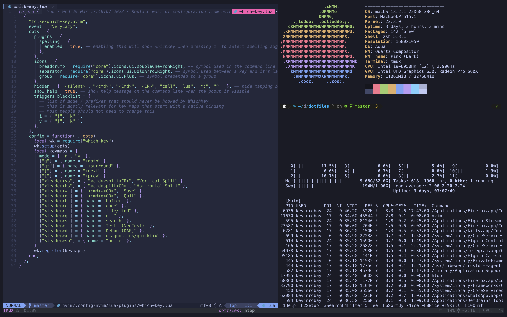

# dotfiles

Hi,

These are my personal dotfiles that I use daily to do my job. They might not work for you, but feel free to take something. But if you find something that could be improved or you think is broken you can raise a Pull Request :)



## How to install

First lets ensure our mac behaves the way we like it to. These are the minimal setup I cannot live without when using a mac.

```bash
# Require password immediately after sleep or screen saver begins
defaults write com.apple.screensaver askForPassword -int 1
defaults write com.apple.screensaver askForPasswordDelay -int 0

# Disable “natural” (Lion-style) scrolling
defaults write NSGlobalDomain com.apple.swipescrolldirection -bool false

# Set the icon size of Dock items to 36 pixels
defaults write com.apple.dock tilesize -int 36

# Hot corners
# Possible values:
#  0: no-op
#  2: Mission Control
#  3: Show application windows
#  4: Desktop
#  5: Start screen saver
#  6: Disable screen saver
#  7: Dashboard
# 10: Put display to sleep
# 11: Launchpad
# 12: Notification Center
# Top left screen corner → Mission Control
defaults write com.apple.dock wvous-tl-corner -int 2
defaults write com.apple.dock wvous-tl-modifier -int 0
# Top right screen corner → Desktop
defaults write com.apple.dock wvous-tr-corner -int 4
defaults write com.apple.dock wvous-tr-modifier -int 0
# Bottom left screen corner → Start screen saver
defaults write com.apple.dock wvous-bl-corner -int 5
defaults write com.apple.dock wvous-bl-modifier -int 0

# Use list view in all Finder windows by default
# Four-letter codes for the other view modes: `icnv`, `clmv`, `glyv`
defaults write com.apple.finder FXPreferredViewStyle -string "Nlsv"

# Delete all cached config to ensure the new one is picked up
sudo find / -name ".DS_Store" -exec rm {} \;

for app in "Dock" "Finder"; do
	killall "${app}" > /dev/null 2>&1
done

```

### Apps 

Now let's install all the tools I currently use on my mac

```bash
ruby -e "$(curl -fsSL https://raw.githubusercontent.com/Homebrew/install/master/install)"
brew doctor

# Link Homebrew casks in `/Applications` rather than `~/Applications`
export HOMEBREW_CASK_OPTS="--appdir=/Applications"

brew bundle

touch ~/.secrets
touch ~/.zsh_history

sh .osx

stow -t $HOME config
```
