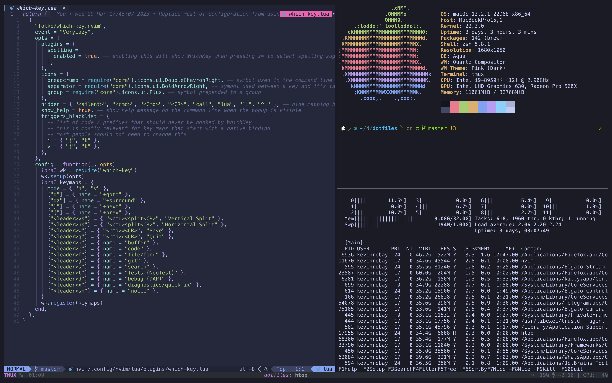

# dotfiles

Personal macOS dotfiles managed with [GNU Stow](https://www.gnu.org/software/stow/). Configs for Neovim, zsh, tmux, git, and more — plus 150+ Homebrew packages and opinionated macOS defaults.



## Quick Start

```bash
git clone https://github.com/kevinrobayna/dotfiles ~/dev/dotfiles
cd ~/dev/dotfiles
./install.sh all        # Run everything below
```

Or run individual steps:

```bash
./install.sh link       # Symlink configs into $HOME (via stow)
./install.sh homebrew   # Install Homebrew packages from Brewfile
./install.sh shell      # Set zsh as default shell
./install.sh macos      # Apply macOS system defaults
./install.sh tmux       # Install tmux plugin manager + terminfo
./install.sh extras     # Install extra gems and language plugins
```

## What's Inside

**Shell** — zsh with [starship](https://starship.rs) prompt, [zoxide](https://github.com/ajeetdsouza/zoxide) smart cd, [fzf](https://github.com/junegunn/fzf) fuzzy finder, [eza](https://github.com/eza-community/eza) ls replacement, and custom aliases

**Editor** — [Neovim](https://neovim.io) with [LazyVim](https://www.lazyvim.org) framework, language servers, treesitter, formatters, and git integration

**Terminal** — [Ghostty](https://ghostty.org), [Alacritty](https://alacritty.org), and [tmux](https://github.com/tmux/tmux) with custom keybindings and status line

**Git** — [delta](https://github.com/dandavison/delta) for diffs, [lazygit](https://github.com/jesseduffield/lazygit) TUI, GPG commit signing, custom hooks

**macOS** — [Hammerspoon](https://www.hammerspoon.org) hotkeys, Finder tweaks, keyboard repeat speed, Dock settings, and 30+ system defaults

**Dev Tools** — Docker via [Colima](https://github.com/abiosoft/colima), [asdf](https://asdf-vm.com)/[nvm](https://github.com/nvm-sh/nvm)/[rbenv](https://github.com/rbenv/rbenv) version managers, AWS CLI, GCloud CLI, [k9s](https://k9scli.io)

## Custom Scripts

Scripts in `bin/` are added to `$PATH`:

| Script | Description |
|--------|-------------|
| `gwt` | Create a git worktree with interactive branch selection, opens in tmux |
| `gwt-rm` | Remove git worktrees and their associated tmux sessions |
| `gh-review` | List GitHub PRs requesting your review (direct + team) |
| `gh-reviewers` | Interactively add reviewers to a GitHub PR |
| `tmux-sessionizer` | Fuzzy-pick a project and open/attach a tmux session |

## Architecture

Configs are symlinked into `$HOME` using GNU Stow with three packages:

```
config/          -> $HOME          (contains .config/ subtree: nvim, zsh, tmux, git, etc.)
gitconfig/       -> $HOME          (--dotfiles flag: dot-gitconfig becomes .gitconfig)
claude/          -> $HOME          (--dotfiles flag: dot-claude/ becomes .claude/)
```

Manual symlinks for apps that use `~/Library/Application Support/`:

```
lazygit/config.yml    -> ~/Library/Application Support/jesseduffield/lazygit/config.yml
lazydocker/config.yml -> ~/Library/Application Support/jesseduffield/lazydocker/config.yml
ghostty/config        -> ~/Library/Application Support/com.mitchellh.ghostty/config
```

## Requirements

- macOS
- [Homebrew](https://brew.sh) (installed automatically by `install.sh` if missing)
